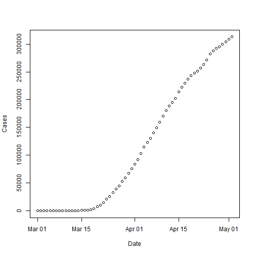

Covid-19 U.S. States Analysis and Forecast
========================================================
author: Julio Costa
date: May 10, 2020
autosize: true

Covid-19 App
========================================================

This is a Shiny that can be located at <https://gemini35.shinyapps.io/ddp_covid19_state/>.

- This app uses New York Times Covid-19 data. The data is available at Github <https://github.com/nytimes/covid-19-data>
- This app plots every state cumulative data for both number of cases and deaths related to Covid-19
- This app also can forecast number of case or deaths for up to 30 days using two different models

Slide With Code
========================================================
The app uses the following libraries

```r
library(shiny)
library(shinythemes)
library(dplyr)
library(readr)
library(forecast)
library(lubridate)
library(xts)
state_data <- read_csv("data/us-states.csv")
head(state_data,3)
```

```
# A tibble: 3 x 5
  date       state      fips  cases deaths
  <date>     <chr>      <chr> <dbl>  <dbl>
1 2020-01-21 Washington 53        1      0
2 2020-01-22 Washington 53        1      0
3 2020-01-23 Washington 53        1      0
```

Sample Plot for New York State
========================================================




Basic Instructions
========================================================
- Select state
- Select type of data either Cases or Deaths
- Select which forecast model to use
- Use slider to smooth the data and to select number of days to forecast

Summary
========================================================
- This is very basic app that introduces user to easily visualize how Covid-19 is spreading throughut the states in America.
- User can also use this app to forecast Covid-19 spread and possibly help make personal decisions regarding travel in areas focused in this study.

